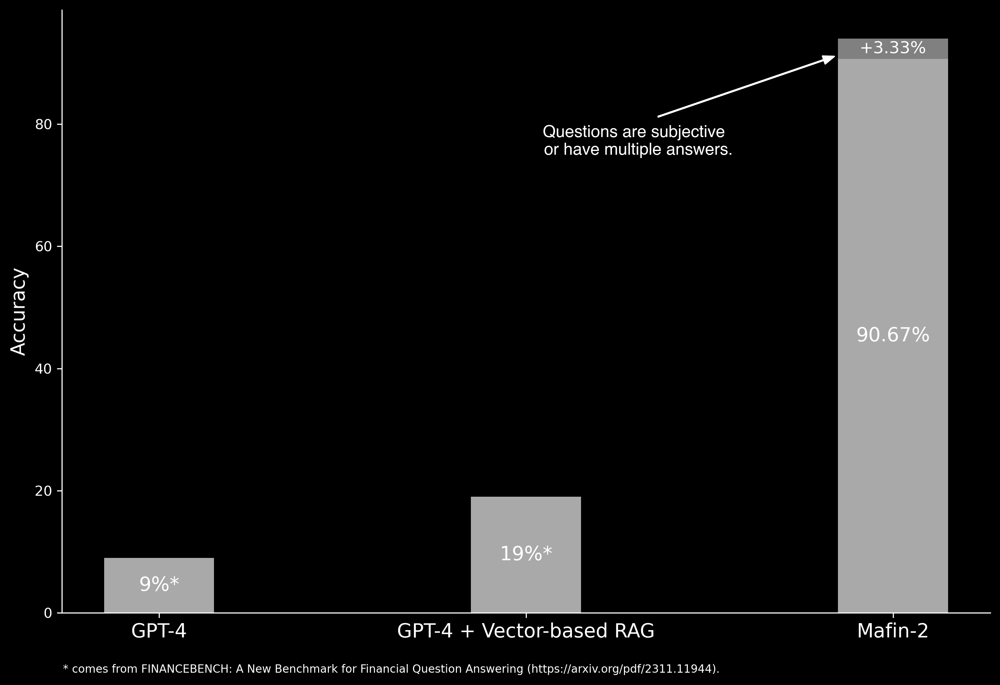

# Finbench Result of Mafin-2

This repository contains the results of our finance benchmark evaluations using our Mafin-2 system. These evaluations are based on the FinanceBench benchmark as introduced in the paper [FinanceBench: A New Benchmark for Financial Question Answering](https://arxiv.org/pdf/2311.11944).

## Mafin-2 Introduction
Mafin-2 is Vectify's next-generation Retrieval Augmented Generation (RAG) system. It contains three key building blocks:
1. A fine-tuned LLM model as the base model for generation.
2. A fine-tuned embedding model to construct the node states in a knowledge tree.
3. The Monte Carlo Tree Search (MCTS) technique with value function approximation to conduct the retrieval.

You can find the old Mafin-1 method in our technique report: [Mafin: Enhancing Black-Box Embeddings with Model Augmented Fine-Tuning](https://arxiv.org/abs/2402.12177), which describes our embedding fine-tuning method. 

## Benchmark Overview

[FinanceBench](https://arxiv.org/pdf/2311.11944) is a pioneering test suite designed to evaluate the performance of large language models (LLMs) on open-book financial question answering (QA). It includes questions about publicly traded companies, each accompanied by corresponding answers and evidence strings. 
It has the following key features:
- **Ecologically valid questions:** Cover a diverse set of scenarios relevant to publicly traded companies.
- **Model evaluation:** Includes assessment of 16 state-of-the-art model configurations such as GPT-4.
- **Limitations identified:** Highlights the limitations of current LLMs for financial QA, including hallucinations and refusal to answer.

## Evaluation Results
We use the most practical setting, which stores all the documents in one database and evaluates Mafin-2 on the [FinanceBench public set](https://github.com/patronus-ai/financebench). 
We invite domain experts to evaluate all the answers manually, which yields the following results:

  
  

| Evaluation Category                                                                    | Result    |
|----------------------------------------------------------------------------------------|-----------|
| **Correct Answer**                                                                     | 90.67%    |
| - Aligned with Benchmark Answers                                                       | 82.67%    |
| - Benchmark Answers are Wrong                                                          | 8.00%     |
| **Valid Answer + Questions are Subjective / Invalid or Have Multiple Answers**          | 3.33%     |
| **Incorrect Answer / Not Found**                                                       | 6.00%     |

- All the tested questions, generated answers, and the evaluation labels can be found in [here](https://github.com/VectifyAI/Finbench-Result/blob/main/financebench_result.json).
- We report the wrong answers and invalid questions in the FinanceBench repo: [invalid questions](https://github.com/patronus-ai/financebench/issues/5) and [wrong answers](https://github.com/patronus-ai/financebench/issues/7).

## Contact
If you have questions about these results or want to try our beta version, email us at contact@vectify.ai.
